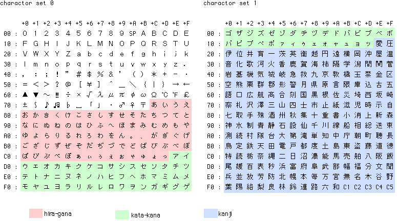

# vx7r -- Python script to replace vx7clone and VX-7 Commander

The binary configuration is 16211 bytes long, written in 3 blocks:
first block 10 bytes, 2nd 8 bytes, 3rd 16211 - 18 = 16193 bytes

After the first two blocks, send an ack back and expect an ack in reply.

Anything else terminates transfer.

After the final block, send nothing but check checksum.

After writing old.vxr, hitting V/M key shows D.014 at top.
Find out what this encodes into.

Running `./vxclone.py chardump` should print out something resembling this:

